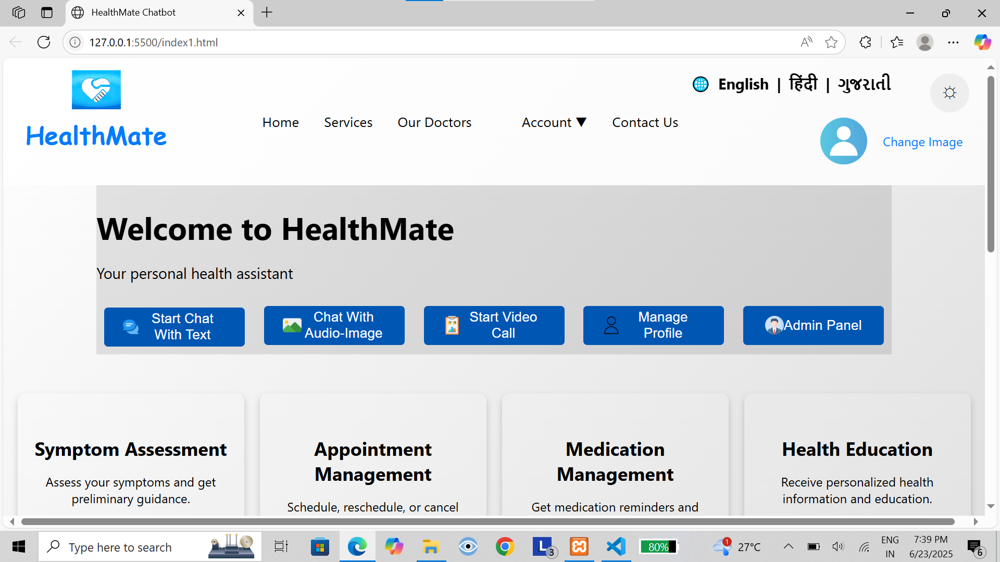

# 🩺 HealthMate – AI-Powered Healthcare Chatbot

**HealthMate** is an AI-powered healthcare chatbot designed to assist users with health-related information and support. It uses local memory (FAISS) and medical data to provide contextually accurate and helpful responses.

---

### 💬 Screenshot


---

## 📦 Installation

1. **Download the ZIP file from GitHub**  
   Download the full project ZIP from [https://github.com/Dhruvsongara/Healthmate/blob/main/HealthMate%20Chatbot.zip](#).

2. **Extract the ZIP file**  
   Unzip the downloaded file into your desired directory.

---

## 📁 Project Structure

Your extracted folder should contain the following important directories and files:

HealthMate/
│
├── data/
│ └── Gale_Encyclopedia_of_Medicine.pdf
│
├── images/
│ └── chatbot.png
│
├── templates/
│ └── index.html
│
├── vectorstore/
│ ├── index.faiss
│ └── index.pkl
│
├── create_memor_for_llm.py
├── connect_memory_with_llm.py
├── healthmate.py
└── (other support files)


---

## ⚙️ Setup & Usage

Follow these steps to run the chatbot:

1. **Step 1 – Install Requirements**  
   Make sure you have Python 3.8+ installed. Then, install dependencies:

   ```bash
   pip install -r requirements.txt

2. **Step 2 – Create Vector Memory**
Run the following script to create memory for the language model:

    python create_memor_for_llm.py

3. **Step 3 – Connect Memory to LLM**
In a new terminal, start the memory connection process:

    python connect_memory_with_llm.py

4. **Step 4 – Start the Chatbot UI**
In another terminal (while the memory is still connected), run:

    python healthmate.py

Go to given port in your terminal in your browser to start chatting with HealthMate.


